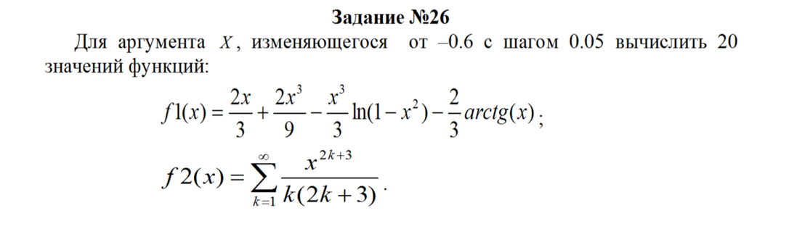
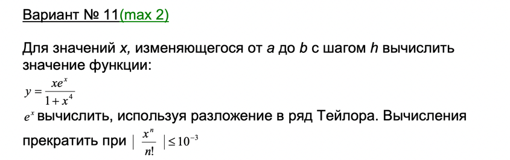

# **Задание 26**


> Delphi
```Delphi
Program laba3;

uses
  SysUtils;
var
  f1, f2, h, x, eps, PredStep, CurrStep, chisl: real;
  k, N, i: byte;
Begin
  writeln('------------------------------------------------------------------------');
  writeln('|       |        |     e=10^-2     |     e=10^-3     |     e=10^-4     |');
  writeln('|   x   |  f1(x) |------------------------------------------------------');
  writeln('|       |        |  f2(x) |   N    |  f2(x) |   N    |  f2(x) |   N    |');
  writeln('------------------------------------------------------------------------');
  x := -0.6; // начальное значение
  h := 0.05; // шаг

  for i := 1 to 20 do
  begin
    f1 := 2 * x / 3 + 2 * x * x * x / 9 - x * x * x / 3 * ln(1 - x * x) - 2 / 3
      * arctan(x); // подсчет функции 1
    write('|', x:7:2, '|', f1:8:4, '|');
    k := 1;
    N := 0;
    CurrStep := 0;
    eps := 0.01;
    f2 := 0;
    chisl := x * x * x * x * x;

    repeat // подсчет функции 2
      PredStep := CurrStep;
      CurrStep := chisl / (k * (2 * k + 3));
      k := k + 1;
      N := N + 1;
      f2 := f2 + CurrStep;
      if Abs(Abs(CurrStep) - Abs(PredStep)) < eps then
      // условие изменения точности
      begin
        write(f2:8:4, '|', N:8, '|');
        eps := eps / 10; // изменение точности
      end;
      chisl := chisl * x * x;

    until (eps < 0.0001); // условие выхода из цикла и остановки вычислений
    writeln;
    x := x + h;
  end;
  writeln('------------------------------------------------------------------------');
  readln;
end.
```
## Дополнительное задание 


```Delphi
program laba3dop11;
uses
  System.SysUtils;
var
  a, b, h, x: real;
procedure Myfunction(x: real);
var
  slt, s, n, y: real;
begin
  y := 0;
  s := 1;
  slt := x;
  n := 1;
  while abs(slt) > 0.001 do

  begin
    s := s + slt;
    n := n + 1;
    slt := slt * x / n;
  end;
  y := x * s / (1 + x * x * x * x);
  writeln('x=', x:7:3, '    y=', y:7:3);
end;

begin
  writeln('Enter the initial value of x');
  readln(a);
  writeln('Enter the final value of x');
  readln(b);
  writeln('Enter a step value');
  readln(h);

  x := a;
  if ((a < b) and (h <= 0)) or ((a > b) and (h >= 0)) then
  begin
    Myfunction(x);
    Myfunction(b);
  end
   else
    if h > 0 then
    begin
      while x < b - h / 10 do
      begin
        Myfunction(x);
        x := x + h;
      end;
      Myfunction(b);
    end
      else
      begin
        while x > b - h / 10 do
        begin
          Myfunction(x);
          x := x + h;
        end;
        Myfunction(b);
      end;
  readln;
end.
```


